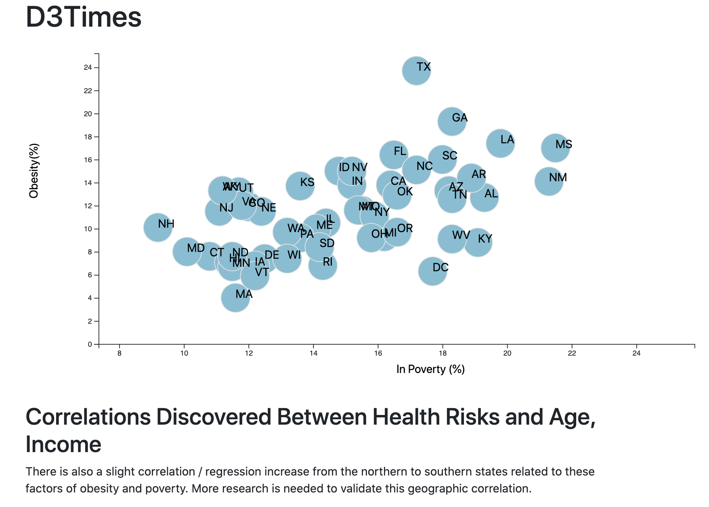

# D3 Scatter Plot

---
The dataset pertains to health risks facing particular demographics. Using the D3 JavaScript library to create a scatter plot that represents each state with circle elements. 
